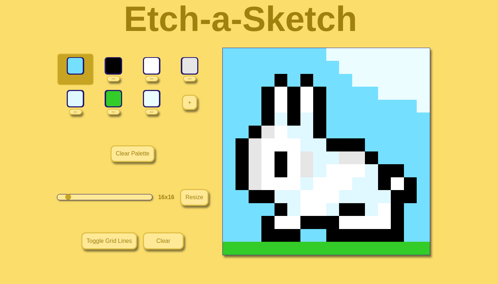

# Etch-A-Sketch Web App
Welcome to the Etch-A-Sketch Web App! This simple web application allows you to unleash your creativity by drawing with your mouse on a square tiled canvas. It offers various features to enhance your drawing experience, including pencil and eraser tools, color selection, grid management, canvas resizing, and more.

## Motivation
The motivation behind this project is to practice Front-End Development and demonstrate skills in JavaScript dynamic component generation. This app will offer an interactive platform for drawing and sketching. Whether you're an artist looking for a pixel-art digital canvas or simply want to have fun, this app allows you to express your creativity in a user-friendly environment.

## Features
### Pencil and Eraser Tools
**Pencil**: Use the pencil tool to draw on the canvas. You can select your preferred pencil color using the color picker.

**Eraser**: The eraser tool lets you easily correct mistakes by erasing specific parts of your drawing.

### Color Picker
**Color Picker**: You can easily pick colors from the canvas by clicking on an area with your mouse. The selected color will be set as the pencil color, and you will seamlessly return to the tool you were using before, enhancing your drawing experience.

**Color Selection**: Choose your favorite colors from the color selection palette to customize your drawings. The selected color will be used by the pencil tool.

**Background Color**: You can also change the background color of the canvas, and it will automatically recolor all background tiles as well as affect eraser tool canvas.

### Grid Management
**Grid Toggle**: Switch the grid on and off to have a clear view of your drawing or align your sketches neatly.

**Grid Resize**: Adjust the grid size using the slider and apply new size with corresponding button. Keep in mind that resizing the grid will clear your current drawing.

### Clear Canvas
**Clear Canvas**: If you want to start fresh, you can click the "Clear" button to erase your entire drawing.

## How to Use
1. **Access the Web App**: Visit the website where the Etch-A-Sketch Web App is hosted.
2. **Canvas Drawing**: Use the mouse to draw on the canvas. The active tile will be highlighted to help you with drawing. Select your pencil color from the color picker to customize your strokes.
3. **Eraser**: To erase parts of your drawing, switch to the eraser tool and click and drag over the areas you want to remove.
4. **Color Picker**: Want to use color you alredy have in your drawing? You don't have to eyeball - Color Picker tool has got you covered! Just click on the color you need, and it will be set as the pencil color.
5. **Background Color**: Change the background color by selecting a new color from the color picker. The canvas will automatically update.
6. **Grid Management**: Toggle the grid on and off using the provided button. You can also resize the grid using the slider.
7. **Clear Canvas**: To start a new drawing from scratch, click the "Clear" button.

## Feedback and Issues
If you encounter any issues while using the Etch-A-Sketch Web App or have suggestions for improvements, please open an issue on the GitHub repository. Your feedback is valuable and will help make this app even better.

### Credits
This project was created with passion by  Maryna Snihurska (aka RinaSatsu). Special thanks to The Odin Project for their idea of this project.

Enjoy sketching and drawing with the Etch-A-Sketch Web App!
